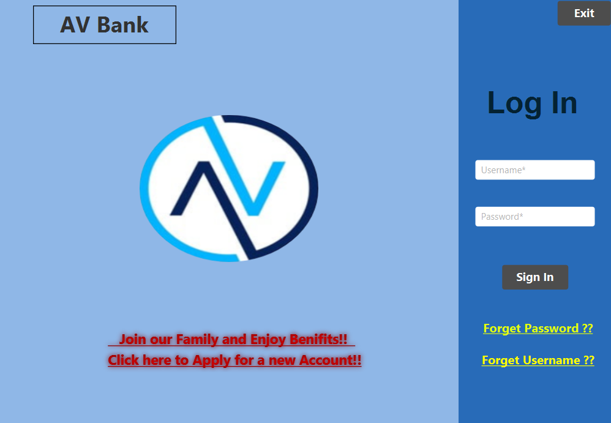
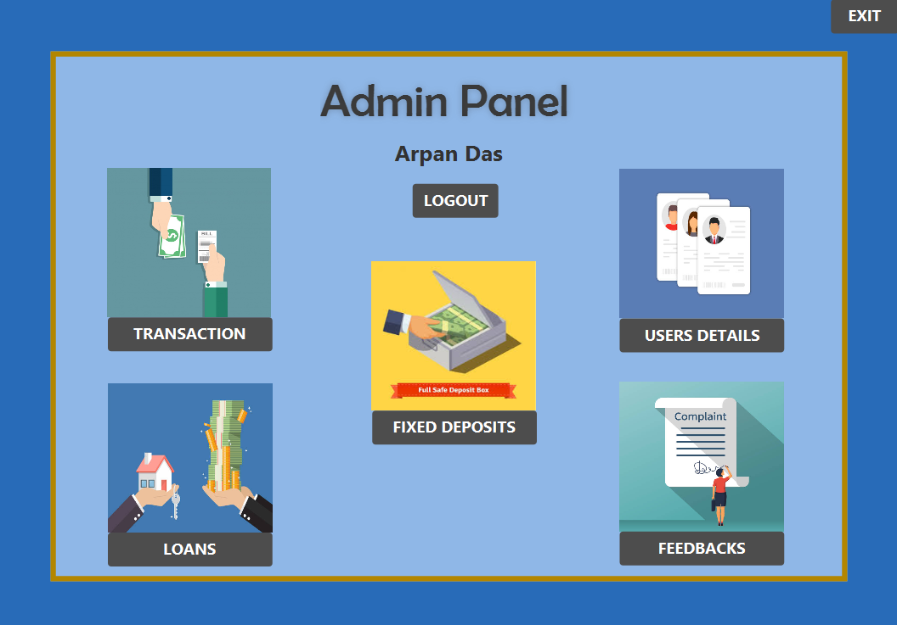
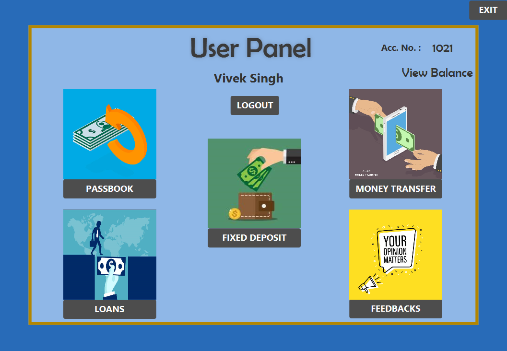

# Banking-System  
## This app is built for following purpose:-  
* For controlling authorized users login.  
* Maintaining users record.  
* Money transfer and other banking facilities in a graphically manner.   
* User Friendly.  
* For Implemention of SQLite in Java GUI.  
* This is a Mini-project developed using JavaFX, SQLite, Email API And CSS 

  

## Admin Have Following Access for this app:-  
* Make transactions under users concerns.  
* Approve or reject loan requests from users.  
* Check active fixed deposits.  
* Check users feedbacks and complaints.  
* Update user's records.  

  

## Users Have Following Access for this app :-  
* Create an account. 
* Reset Password.
* Login.  
* Check passbook.
* Money Transfer.
* Apply for loan and pay previous loan dues.
* Apply for Fixed Deposits and break active deposits.
* Submit feedabacks and complaints.

  

## Technologies used:-
* JavaFX  
* CSS  
* JDBC  
* SQLite 
* Email API

**Database: A file named as BankingSystem.db filled with some dummy database.**

**"Suggestions and project Improvements are Invited!"**  
  
**Thanks a lot**   
**Project Leader**  
**Arpan Das**
